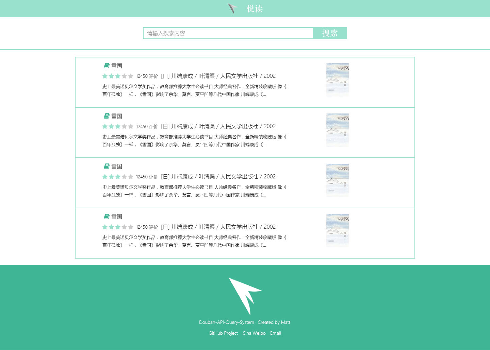
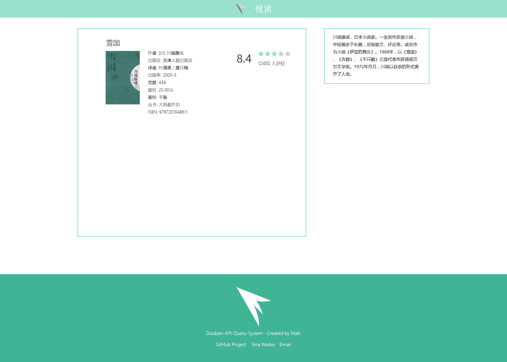

# douban-api
A html5 website which use douban's api to show some books, music and vedio.

### You can visit this query system from my server - [Link](https://www.tongmu.me/douban-api/)

Here's the design image.
  
- [Homepage](https://www.tongmu.me/design/douban-api/homepage.psd)

- [Homepage](https://www.tongmu.me/design/douban-api/page.psd)

